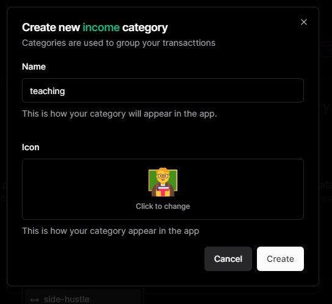
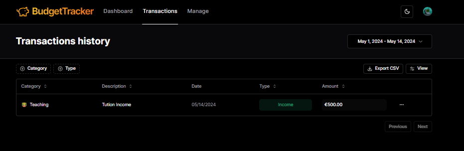

<h1 align="center" id="title">BudgetTracker</h1>

BudgetTracker is a cutting-edge end-to-end budget management application built using a robust technology stack that combines the power of TypeScript ReactJS NextJS PostgreSQL and a variety of other innovative tools. This comprehensive solution empowers users to effectively manage their financial lives by providing a seamless and intuitive interface for tracking income expenses and investments.It also includes the capability to export financial data to CSV files, providing users with a convenient way to analyze and manipulate their financial information

<h2>🧐 Features</h2>

Here're some of the project's best features:

- Category Management: Users can create new categories to organize their financial data making it easier to analyze and manage their spending habits.
- Transaction Management: BudgetTracker allows users to create new transactions track expenses and monitor income. This feature is designed to provide a clear picture of financial activities enabling informed decision-making.
- Deletion Capabilities: The app includes the ability to delete categories and transactions ensuring that users can maintain a clean and organized financial record.
- Data Export to CSV: BudgetTracker now supports exporting financial data to CSV files, allowing users to download and analyze their data outside the app.
- Monthly and Yearly Data Aggregation: The app provides users with the ability to view their financial data in monthly and yearly aggregate forms, enabling them to analyze trends and compare spending over time.

<h2>💻 Built with</h2>

Technologies used in the project:

- TypeScript
- ReactJS
- NextJS
- PostgreSQL
- Emoji-picker
- Prisma
- Tailwind CSS
- React Hook Form
- TenStack React Query
- Shadcn UI
- Lucide React
- Zod Validation
- Clerk Auth
- Recharts
- Export-to-CSV

<h2>ScreenShots</h2>

      1. Log In / Sign Up

      2. Setup currency

      3. Home Page

      4. create new category

      5. create new transaction

      6. Chart Updation

      7. Manage Page

      8. Transaction Page

 
<h2>Project Description</h2>

<h3>BudgetTracker : A Comprehensive Budget Management Solution</h3>

**_BudgetTracker is a cutting-edge end-to-end budget management application built using a robust technology stack that combines the power of TypeScript ReactJS NextJS PostgreSQL and a variety of other innovative tools. This comprehensive solution empowers users to effectively manage their financial lives by providing a seamless and intuitive interface for tracking income expenses and investments._**
` `

**Key Features Category Management:**
` `

1. Users can create new categories to organize their financial data making it easier to analyze and manage their spending habits.
2. Transaction Management: BudgetTracker allows users to create new transactions track expenses and monitor income. This feature is designed to provide a clear picture of financial activities enabling informed decision-making.
3. Deletion Capabilities: The app includes the ability to delete categories and transactions ensuring that users can maintain a clean and organized financial record.

`  `
**Technical Stack** - BudgetTracker leverages the following technologies to deliver a robust and scalable solution:

1. TypeScript: Ensuring type safety and robust logic implementation.
2. ReactJS: Providing a responsive and interactive user interface.
3. NextJS: Enhancing performance and SEO with server-side rendering.
4. PostgreSQL: Serving as the database management system for reliable data storage.
5. Recharts: Enabling the visualization of financial data through interactive charts.
6. Emoji-picker: Adding a touch of personalization to the user interface.
7. Prisma: Facilitating data modeling and database interactions.
8. Tailwind CSS: Styling the application's UI for a consistent visual design.
9. Export-to-CSV: Enabling seamless data export functionality to CSV files.
10. React Hook Form: Managing forms and enhancing user experience.
11. Tanstack React Query: Handling data fetching and caching efficiently.
12. Shadcn UI: Providing a customizable and responsive UI component library.
13. Lucide React: Enhancing the user interface with customizable icons.
14. Zod Validation: Ensuring data integrity and security through validation.
15. Clerk Auth: Managing user authentication and authorization securely.

`  `

**How BudgetTracker Works** ` `
BudgetTracker is designed to provide users with a comprehensive and user-friendly interface for managing their financial lives. Here's how it works:

1. User Onboarding: Users sign up for the app and are guided through a simple onboarding process where they can link their bank accounts and set up their budgeting goals.
2. Transaction Tracking: BudgetTracker automatically fetches transactions from linked bank accounts categorizes them and displays them in a clear and organized manner.
3. Budgeting: Users can set their budget for a specific period and the app will track their spending and provide alerts when they go over budget.
4. Goal Setting: Users can set financial goals such as saving for a specific expense or paying off debt and the app will provide personalized advice and recommendations to help them achieve those goals.
5. Expense Categorization: BudgetTracker allows users to create custom categories and subcategories for their expenses making it easier to track and analyze their spending habits.
6. Deletion Capabilities: Users can delete categories and transactions ensuring that their financial data remains organized and up-to-date.
7. Security: BudgetTracker uses robust security measures including encryption and secure APIs to protect user data and prevent unauthorized access.
8. Notifications: The app sends users notifications when they go over budget when they have a low balance or when they have a specific financial goal to achieve.
9. Customization: BudgetTracker allows users to customize their experience by setting up custom categories subcategories and budgeting goals.
10. Integration: The app integrates with popular financial services such as bank accounts and investment platforms to provide users with a comprehensive view of their financial lives.
11. Export-to-CSV library:The app likely utilizes a dedicated library or component for exporting data to CSV format.This library provides a simple and efficient way to generate CSV files from JavaScript data structures.

`  `
**Recharts Features**
` `
The BudgetTracker app provides users with the ability to view their financial data in monthly and yearly aggregate forms, allowing them to analyze trends and compare spending over time. Here's how it works:

**_Monthly Aggregation:_**

- The app collects and stores financial data, such as income, expenses, and transactions, on a daily basis
- Users can view a monthly summary of their finances by selecting a specific month from a dropdown menu or calendar
- The monthly view displays aggregated totals for income, expenses, and savings for the selected month
- Users can also see a breakdown of expenses by category for the month, which helps them identify areas where they are spending more or less compared to previous months
- Charts and graphs are used to visualize the monthly data, making it easier for users to spot trends and patterns in their spending habits

**_Yearly Aggregation_**

- The app also provides a yearly view of financial data, allowing users to compare their performance across multiple years
- Users can select a specific year from a dropdown menu or calendar to view the aggregated yearly totals for income, expenses, and savings
- The yearly view also includes a comparison of the current year's data to the previous year, highlighting any significant changes or trends
- Expense categories are also shown on a yearly basis, enabling users to identify areas where they have increased or decreased spending compared to the previous year
- Yearly data is presented in a clear and concise manner, with charts and graphs providing a visual representation of the aggregated information

By offering both monthly and yearly aggregation of financial data, the BudgetTracker app empowers users to gain a comprehensive understanding of their spending patterns and make informed decisions about their financial future. The ability to compare data across different time periods helps users identify areas for improvement and track their progress towards financial goals.

**Conclusion** - BudgetTracker is a comprehensive budget management solution that combines the power of innovative technologies to deliver a robust scalable and user-friendly application. It also offers an enriched user experience with the added functionality of exporting financial data to CSV files. With its extensive feature set and robust technical stack this app is poised to revolutionize the way users manage their finances providing a seamless and intuitive experience for effective budgeting and financial planning.
